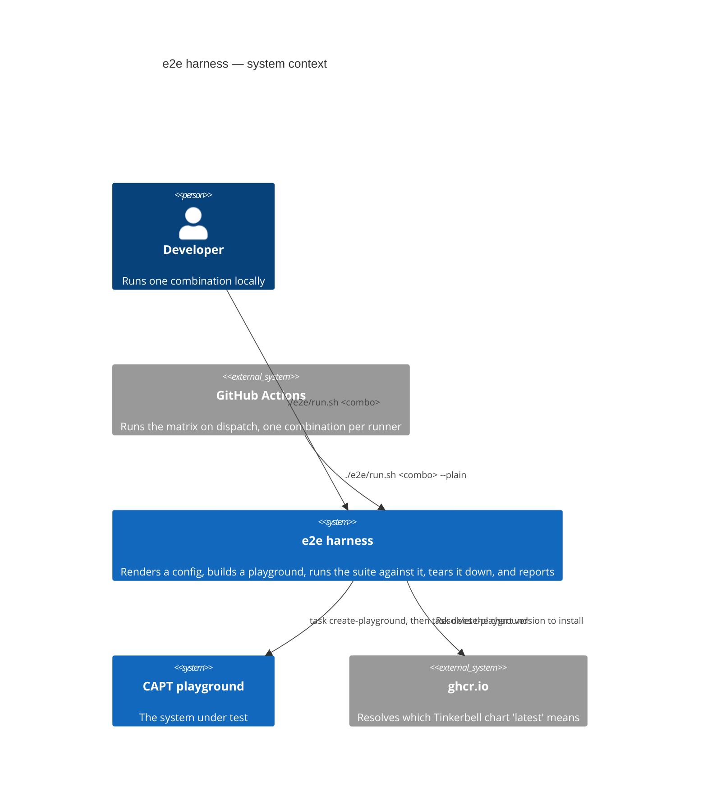
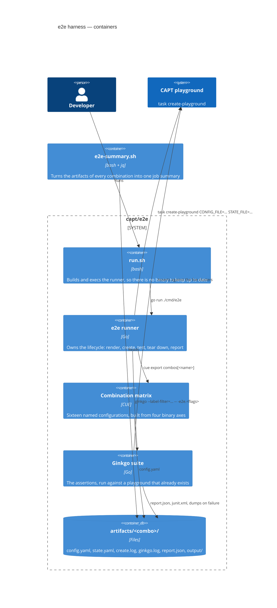
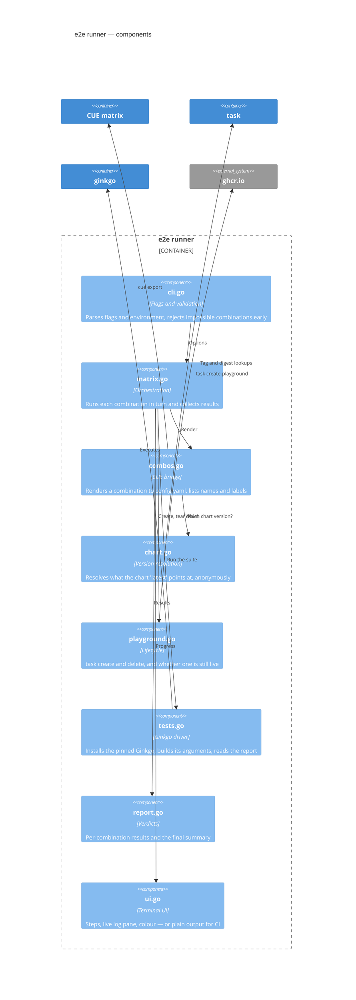
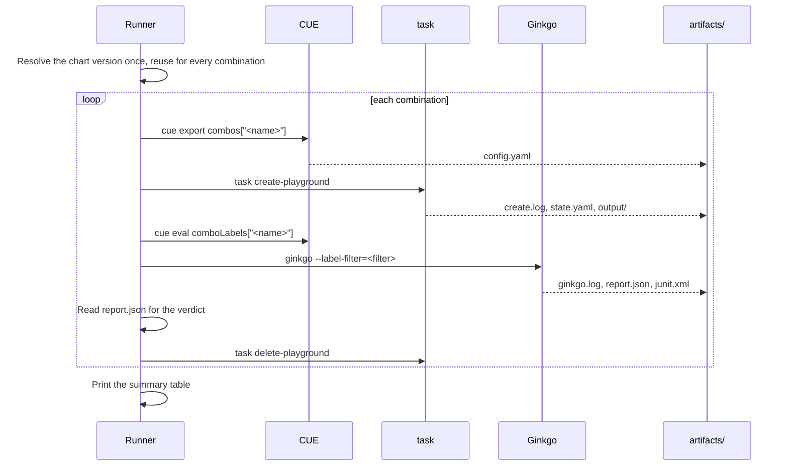

# Architecture: the e2e harness

C4 diagrams for the end-to-end test harness in [capt/e2e](../e2e). For what the
tests actually do and why they are shaped this way, read the
[explanation](./explanation-e2e.md); to change them, follow the
[how-to](./how-to-e2e.md).

The harness exists to answer one question repeatedly: **does a playground of
shape X still provision a working cluster?** Everything below follows from
needing that answer for sixteen shapes of X, on a laptop and on a CI runner,
with enough evidence left behind to debug a failure hours later.

## Level 1: system context



## Level 2: containers



The playground never learns it is under test. The runner writes a `config.yaml`
into the combination's artifact directory and points `task` at it with
`CONFIG_FILE` and `STATE_FILE`, so a combination cannot disturb the checked-in
`capt/config.yaml` or another combination's state.

## Level 3: components of the runner



## The matrix

Four binary axes, named in a fixed order, so a combination name says exactly
what it exercises:

```
<topology>-<ipFamily>-<bootMode>-<registry>

colocated | external    Tinkerbell in the management cluster, or its own
ipv4      | ipv6        dual-stack bridge, or IPv6-only machines
netboot   | isoboot     iPXE, or virtual media
direct    | mirror      straight to upstream, or a pull-through cache
```

Sixteen combinations are defined in
[e2e/cue/matrix.cue](../e2e/cue/matrix.cue); the eight `-direct` ones are
offered in CI, because `-mirror` needs a reachable pull-through cache that a
hosted runner does not have.

## One run, end to end



In CI each iteration of that loop is a separate runner, and a final `summary`
job reads every artifact to build one job summary
([.github/scripts/e2e-summary.sh](../../.github/scripts/e2e-summary.sh)).

## Why the suite is given no defaults

Every path the Ginkgo suite needs arrives as an explicit flag — `-e2e.config`,
`-e2e.artifacts`, `-e2e.mgmt-kubeconfig`, `-e2e.workload-kubeconfig`,
`-e2e.tink-kubeconfig`, `-e2e.namespace`, `-e2e.state-file`, `-e2e.cni-script`
([e2e/internal/runner/tests.go](../e2e/internal/runner/tests.go)). The suite has
no working directory it could derive one from and no fallback to the checked-in
playground. Running several combinations in sequence would otherwise risk a
suite asserting against the previous playground's kubeconfig, which fails in a
way that looks like a product bug rather than a harness bug.

`-e2e.mgmt-kubeconfig` doubles as the guard: without it the suite skips rather
than fails, so `go test ./...` over the repository stays green.
