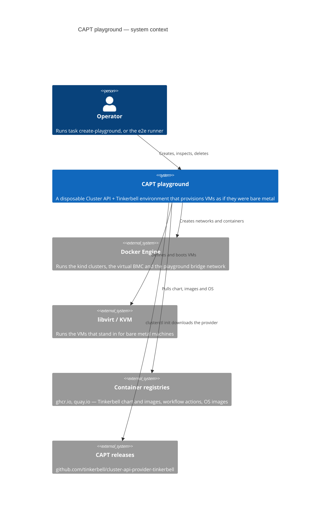
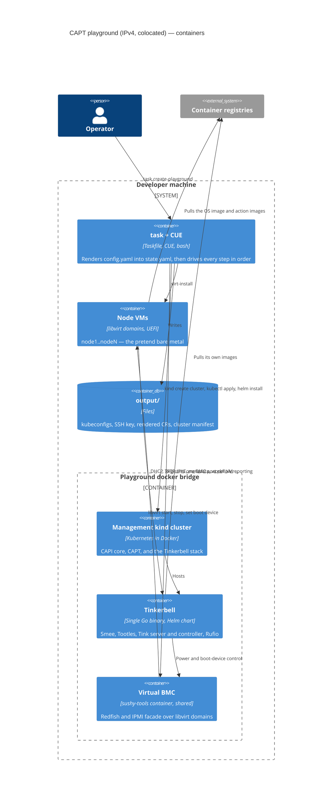
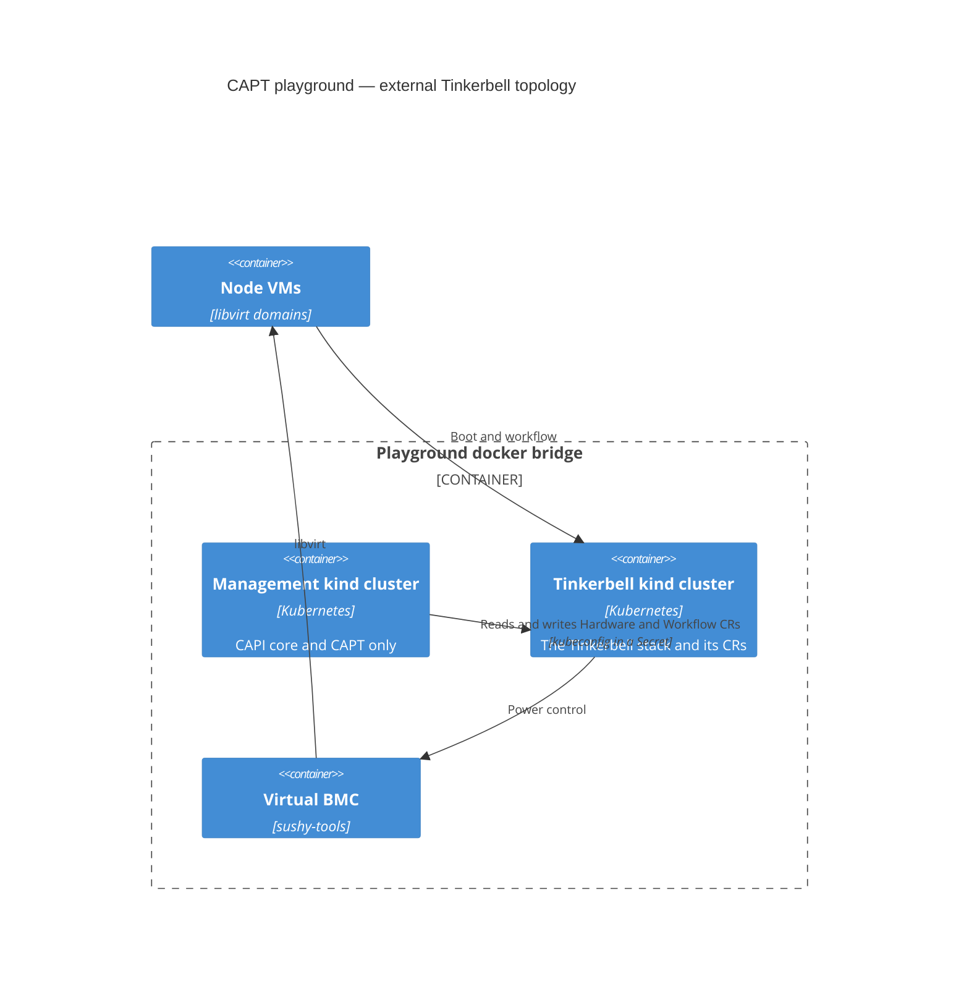
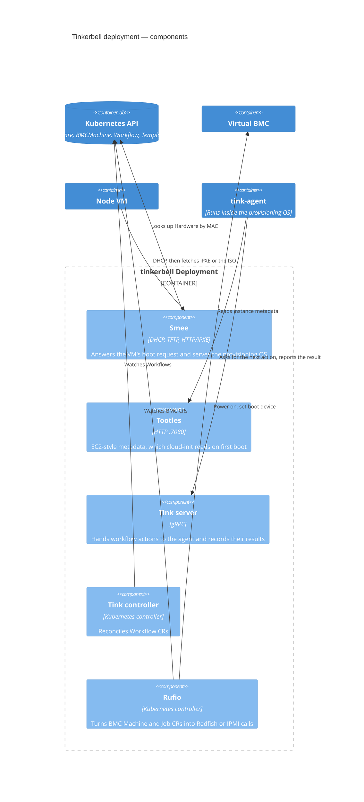
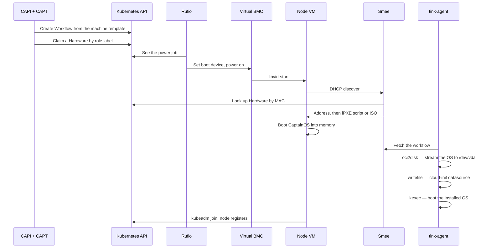

# Architecture: the CAPT playground (IPv4)

C4 diagrams for a playground created with the default `ipFamily: ipv4`. The
[IPv6 architecture](./architecture-playground-ipv6.md) is described as a delta
against this one, so read this first.

Diagrams follow the [C4 model](https://c4model.com/): context, then containers,
then the components inside the one container that matters most.

## Level 1: system context

What the playground is, and what it needs from the machine it runs on.

Everything the playground creates is namespaced by an **instance id** — the
first 8 characters of the SHA-256 of the state file's path
([cue/state/state.cue](../cue/state/state.cue)). That is what lets several
playgrounds share one host without colliding, and it is why the e2e runner gives
each combination its own artifact directory.

## Level 2: containers

The moving parts of one colocated playground (`externalTinkerbell: false`).

Two details that the diagram cannot show:

- **The virtual BMC is shared between playgrounds and outlives any one of
  them.** It runs on the host network so it can reach libvirt, and is attached
  to each playground's bridge as playgrounds come and go. Ports are handed out
  from 6231 in blocks of 16, with the block chosen from the instance id
  ([scripts/vbmc_ports.sh](../scripts/vbmc_ports.sh)), so two playgrounds
  created at the same moment do not start from the same port.
- **A registry only exists for source builds.** With `source:` set, the
  playground builds Tinkerbell and the agent, pushes them to a shared local
  registry, and rewrites the image references in the state file. Otherwise
  nothing local is published.

### External Tinkerbell

With `externalTinkerbell: true` there are two kind clusters on the same bridge:

CAPT reaches the second cluster through a kubeconfig Secret written by
[scripts/create_external_kubeconfig_secret.sh](../scripts/create_external_kubeconfig_secret.sh).
The address in it is the kind node's container IP, which is why a pivot to
another host is not supported in this mode.

## Level 3: components of the Tinkerbell container

The Helm chart deploys **one** container running **one** binary
([cmd/tinkerbell](https://github.com/tinkerbell/tinkerbell/tree/main/cmd/tinkerbell)).
What are separate services in other deployments are subsystems here, each
toggled by a flag, which is why the playground has a single Deployment to watch
rather than five.

## How a node gets provisioned

The diagrams above are static. This is the order things happen in, and it is the
sequence the e2e tests assert on.

`bootMode` changes only the middle of this: `netboot` fetches an iPXE script and
pulls kernel and initrd over TFTP/HTTP, while `isoboot` has Rufio attach
`http://<hookos-vip>:7080/iso/hook.iso` as virtual media
([cue/capi/bootmode.cue](../cue/capi/bootmode.cue)). Everything before and after
is identical, which is why one test suite covers both.

## Addresses

Derived in [cue/state/state.cue](../cue/state/state.cue) from the bridge gateway
docker allocates, so nothing is hard-coded to a subnet:

| Thing                  | Address                            |
| ---------------------- | ---------------------------------- |
| Node VMs               | gateway `.10.1` upward, one per VM |
| Provisioning OS VIP    | gateway `.10.(nodes+50)`           |
| Tinkerbell VIP         | gateway `.10.(nodes+51)`           |
| Workload control plane | gateway `.10.(nodes+52)`           |
| Pod / service CIDRs    | `10.100.0.0/16` / `172.26.0.0/16`  |

The control-plane VIP is held by kube-vip, started as a static pod by the first
control plane node's `preKubeadmCommands`.

## Where to look next

- [IPv6 architecture](./architecture-playground-ipv6.md) — what the translation
  layer adds.
- [e2e architecture](./architecture-e2e.md) — how the test harness drives all of
  the above.
- [capt/README.md](../README.md) — the reference for configuration keys.
