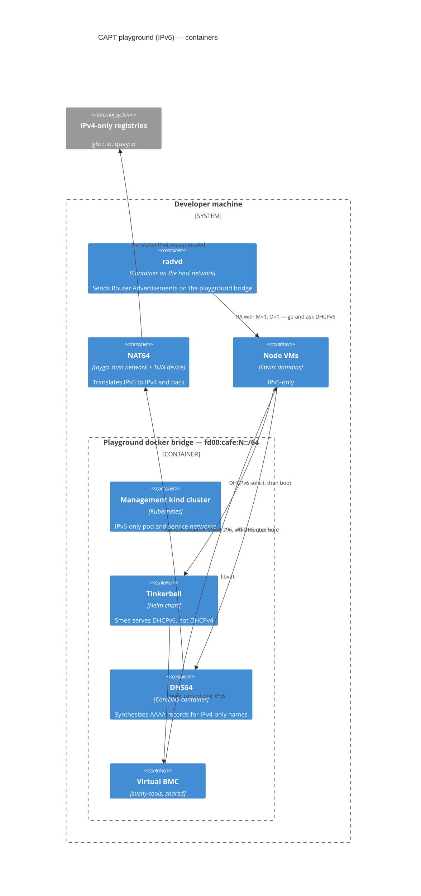
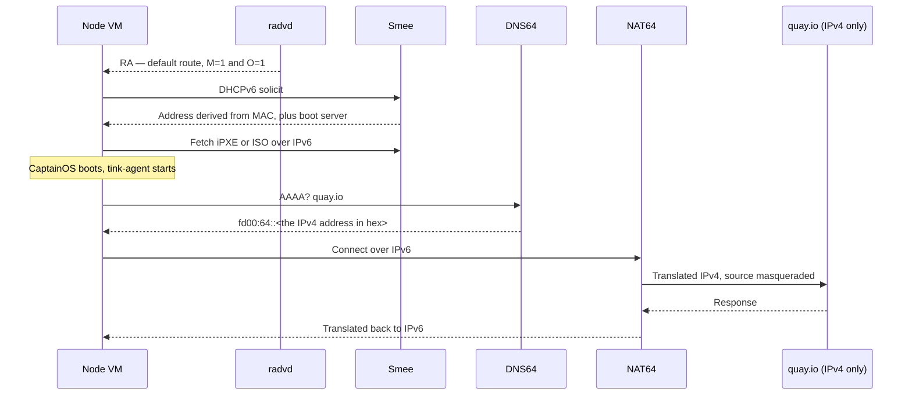

# Architecture: the CAPT playground (IPv6)

`ipFamily: ipv6` does not make the playground dual-stack. It makes the machines
**IPv6-only**: no DHCPv4, no IPv4 address, no IPv4 route. Everything in the
[IPv4 architecture](./architecture-playground-ipv4.md) still applies — the same
kind clusters, the same Tinkerbell binary, the same provisioning sequence — so
this page covers only what changes and why.

Three problems have to be solved, and each adds one container:

| Problem                                                 | Answer                               |
| ------------------------------------------------------- | ------------------------------------ |
| Tinkerbell does not send Router Advertisements          | **radvd**                            |
| The registries the machines need publish no AAAA record | **DNS64**, then **NAT64**            |
| Nothing hands out addresses without DHCPv4              | **Smee's DHCPv6**, in `derived` mode |

## Level 2: containers

## Addressing

Each playground gets its own `/64`. `scripts/network_create.sh` picks the lowest
free `fd00:cafe:N::/64`, so several IPv6 playgrounds coexist without overlapping.

| Thing                  | Address                                 |
| ---------------------- | --------------------------------------- |
| Node VMs               | `<prefix>::10:1` upward                 |
| Provisioning OS VIP    | `<prefix>::10:(nodes+50)`               |
| Tinkerbell VIP         | `<prefix>::10:(nodes+51)`               |
| Workload control plane | `<prefix>::10:(nodes+52)`               |
| DNS64                  | `<prefix>::10:200`                      |
| NAT64 prefix           | `fd00:64::/96`                          |
| Pod / service CIDRs    | `fd00:10:244::/56` / `fd00:10:96::/112` |

Host suffixes all live under `::10:/112` so machines, VIPs and the resolver
cannot collide. The NAT64 prefix is deliberately **not** the well-known
`64:ff9b::/96`: see the comment in [cue/state/state.cue](../cue/state/state.cue).

## Booting without DHCPv4

DHCPv6 has no equivalent of the DHCPv4 "router" option, so a machine will not
configure a default route from DHCPv6 alone — it needs a Router Advertisement,
and Tinkerbell does not send them. That is the whole reason radvd exists here.

DNS64 runs with `translate_all`, so it synthesises an answer even for names that
_do_ publish AAAA. That keeps one path for every lookup instead of a machine
sometimes going native and sometimes through the translator.

Smee's DHCPv6 runs in `derived` mode: the address comes from hashing the MAC
into the bridge's `/64`, so it is stable across reboots without any lease state.

## The listener family trap

Addressing every IPv6 setting the chart has still leaves Tinkerbell listening on
IPv4 alone. The family a listener serves is chosen once, by
`deployment.envs.globals.listenerFamilies`, and everything belonging to a family
that is not chosen is discarded without complaint — including DHCPv6, however
emphatically it was enabled. The chart's install output names the resolved
choice, so `Listeners serve: ipv4` on an IPv6 playground is the whole diagnosis.

## The macvlan trap

The chart attaches a `macvlan0` interface to the bridge so Smee can receive
DHCPv6 multicast. radvd then has to advertise the prefix with **both**
`AdvOnLink` and `AdvAutonomous` off.

If either is on, `macvlan0` acquires an address or an on-link route, pod replies
start leaving through it, and two things break at once: the virtual BMC becomes
unreachable, and TFTP sources itself from the wrong address. With both off,
`macvlan0` gets no address and no route — which does not affect multicast
membership, because joining `ff02::1:2` needs neither — and all unicast stays on
`eth0` behind the VIP. See [tasks/Taskfile-radvd.yaml](../tasks/Taskfile-radvd.yaml).

## The firmware trap

IPv6 is also the only mode that cares which OVMF the VMs boot. iPXE 2.0.0
stopped vetoing edk2's `Dhcp6Dxe` driver, which exposes an edk2 bug where
`EfiDhcp6Stop()` never returns
([tianocore/edk2#10506](https://github.com/tianocore/edk2/issues/10506)); on
Ubuntu 22.04's OVMF 2022.02 the machine hangs right after iPXE starts. Nothing
in the DHCPv6 or macvlan paths above is involved, so it presents as a netboot
failure with a healthy-looking stack behind it.

The Flox environment pins a firmware new enough to have the fix, and
[scripts/lib_ovmf.sh](../scripts/lib_ovmf.sh) passes it explicitly to
`virt-install` and the Virtual BMC rather than letting libvirt choose. See
[capt/README.md](../README.md#firmware).

## Shared, host-wide, and therefore reference-counted

radvd is per playground. NAT64 is **not**: one tayga instance, one TUN device
and one set of host firewall rules serve every IPv6 playground on the machine.
Teardown asks "is any other IPv6 playground left?" by listing the labelled
docker networks, excluding its own
([scripts/nat64_release.sh](../scripts/nat64_release.sh)).

IP forwarding sysctls are turned on and deliberately never turned off, because
docker needs them anyway.

## What the tests exercise

The `*-ipv6-*` combinations run the same assertions as their IPv4 counterparts.
Tests that only make sense on one family carry a Ginkgo label, and the combo's
label filter excludes the other — see the
[e2e explanation](./explanation-e2e.md#labels-and-the-filter).

The `-direct` IPv6 combinations are not a contradiction: ghcr.io publishes no
AAAA record, but DNS64 synthesises one, so "direct" means "no pull-through
mirror", not "native IPv6 to the registry".
